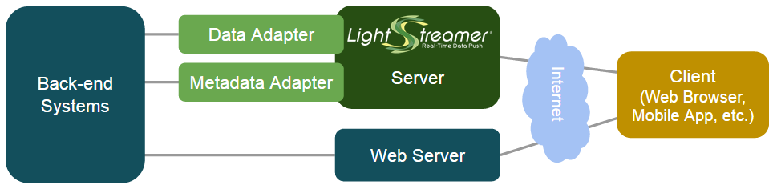

# Lightstreamer Java In-Process Adapter SDK
 
This project includes the source code of the Lightstreamer Java In-process Adapter API specification.
This resource is needed to write Data Adapters and Metadata Adapters for Lightstreamer Server in Java. The adapters will run in process with the Lightstreamer Server.
Each Lightstreamer session requires the presence of an Adapter Set, which is made up of one Metadata Adapter and one or multiple Data Adapters. Multiple Adapter Sets can be plugged onto Lightstreamer Server.
Please refer to [General Concepts](https://lightstreamer.com/docs/ls-server/latest/General%20Concepts.pdf) document for further details about the role of the Adapters in Lightstreamer.



## Configuration

Each Adapter Set is defined by a configuration file called `adapters.xml` placed in a specific subfolder of `/adapters`. Please refer to the WELCOME Adapter Set pre-installed in the factory donwload of Lightstreamer as a reference of Adapters deploy and to [the provided template of adapters.xml](https://lightstreamer.com/docs/ls-server/latest/adapter_conf_template/adapters.xml) for a complete description of all the parameters configurable for an Adapter Set.

In case you want to use Eclipse for developing and running your own Adapter Set, please refer to the instructions provided in this [thread](http://forums.lightstreamer.com/showthread.php?4875-Developing-amp-Running-an-Adapter-Set-Using-Eclipse) of our [Java Adapter API](http://forums.lightstreamer.com/forumdisplay.php?6-Java-Adapter-API) support forum.

## Compatibility

The library is compatible with Lightstreamer Server since 7.1.

## Using the API

Since the API is available from the Maven Central Repository, to setup your development environment add the following dependency to your pom.xml:

```xml
<dependency>
    <groupId>com.lightstreamer</groupId>
    <artifactId>ls-adapter-inprocess</artifactId>
    <version>7.3.1</version>
</dependency>
```

### LiteralBasedProvider Metadata Adapter

This project includes a simple full implementation of Metadata Adapter in Java, <b>LiteralBasedProvider</b>, made available as sample for inspiration and/or extension.

The [LiteralBasedProvider](https://github.com/Lightstreamer/Lightstreamer-lib-adapter-java-inprocess/tree/master/src/main/java/com/lightstreamer/adapters/metadata) extends the [MetadataProviderAdapter](https://lightstreamer.com/api/ls-adapter-inprocess/7.3.1/com/lightstreamer/interfaces/metadata/MetadataProviderAdapter.html) abstract class (which in turn implements the MetadataProvider interface). It is used in many Lightstreamer examples and demos, in combination with different Data Adapters and Clients.
It is also useful when developing proof of concepts and prototypes, where the main focus is on the Data Adapter.

#### Configure the LiteralBasedProvider Metadata Adapter

The following code snippet shows an example of `adapters.xml` configuration of the LiteralBasedProvider Metadata provider and its properties:

```xml
  <!-- Mandatory. Define the Metadata Provider. -->
  <metadata_provider>
    <!-- Mandatory. Java class name of the adapter. -->
    <adapter_class>com.lightstreamer.adapters.metadata.LiteralBasedProvider</adapter_class>

    <!-- Optional. List of initialization parameters specific for the adapter. -->

    <!-- Optional (specific for adapters that inherit from
             com.lightstreamer.adapters.metadata.FileBasedProvider).
             search_dir: path of the directory containing all *.items and
             *.schema files, relative to the config directory.
             static: define whether to cache the files or refresh them any time
             they are needed.
             See the FileBasedProvider javadoc. -->
     <!--
    <param name="search_dir">.</param>
    <param name="static">Y</param>
     -->
    <!-- Optional (specific for adapters that inherit from
             com.lightstreamer.adapters.metadata.FileBasedProvider or
             com.lightstreamer.adapters.metadata.LiteralBasedProvider).
             Define values to be returned in getAllowedMaxBandwidth(),
             getAllowedMaxItemFrequency(), getAllowedBufferSize() and
             getDistinctSnapshotLength() methods, for any User and Item
             supplied and optional comma-separated list of User names
             to be allowed by the notifyUser() method.
             See LiteralBasedProvider javadoc. -->
     <!--
    <param name="max_bandwidth">40</param>
    <param name="max_frequency">3</param>
    <param name="buffer_size">30</param>
    <param name="distinct_snapshot_length">10</param>
    <param name="allowed_users">user123,user456</param>
     -->
     <!-- Optional (specific for adapters that inherit from
             com.lightstreamer.adapters.metadata.FileBasedProvider or
             com.lightstreamer.adapters.metadata.LiteralBasedProvider).
             Define how the modeMayBeAllowed method should behave, by
             associating to each item the modes in which it can be managed
             by the Server.
             Each pair of parameters of the form "item_family_<n>" and
             "modes_for_item_family_<n>" define respectively the item name
             pattern (in java.util.regex.Pattern format) and the allowed
             modes (in comma separated format) for a family of items.
             Each item is assigned to the first family that matches its name.
             If no families are specified at all, then modeMayBeAllowed
             always returns true, though this is not recommended, because
             the Server does not support more than one mode out of MERGE,
             DISTINCT, and COMMAND for the same item. In such a case, the
             Server would just manage each item in the mode specified by the
             first Client request it receives for the item and would be up to
             the Clients to ensure that the same item cannot be requested in
             two conflicting Modes.
             See LiteralBasedProvider javadoc. -->
    <param name="item_family_1">item.*</param>
    <param name="modes_for_item_family_1">MERGE</param>
    <!--
    <param name="item_family_2">item.*</param>
    <param name="modes_for_item_family_2">MERGE,RAW</param>
     -->
  </metadata_provider>
```

Above, are shown only the specific parameters of *LiteralBasedProvider* Metadata Adapter. Use the generic template (see the [Java In-Process Adapter Interface Project](https://github.com/Lightstreamer/Lightstreamer-lib-adapter-java-inprocess#configuration) ) as a reference for a complete overview of configuration options.

## Build

To build your own version of the Java In-process Adapter library, you have two options:
either use [Maven](https://maven.apache.org/) (or other build tools) to take care of dependencies and building (recommended) or gather the necessary jars yourself and build it manually.
For the sake of simplicity only the Maven case is detailed here.

### Maven
You can easily build this library using Maven through the pom.xml file located in the root folder of this project. As an alternative, you can use an alternative build tool (e.g. Gradle, Ivy, etc.) by converting the provided pom.xml file.

Assuming Maven is installed and available in your path you can build the library by running

```sh
 mvn package
```

## External Links

- [Maven repository](https://mvnrepository.com/artifact/com.lightstreamer/ls-adapter-inprocess)

- [Examples](https://demos.lightstreamer.com/?p=lightstreamer&t=adapter&a=javaadapter)

- [API Reference](https://lightstreamer.com/api/ls-adapter-inprocess/7.3.1/)

## Other GitHub projects using this library

- [Lightstreamer - Reusable Metadata Adapters - Java Adapter](https://github.com/Lightstreamer/Lightstreamer-example-ReusableMetadata-adapter-java)

## Support

For questions and support please use the [Official Forum](https://forums.lightstreamer.com/). The issue list of this page is **exclusively** for bug reports and feature requests.

## License

[Apache 2.0](https://opensource.org/licenses/Apache-2.0)
